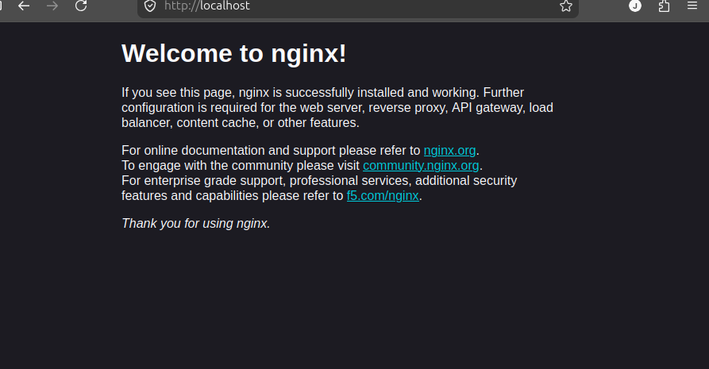
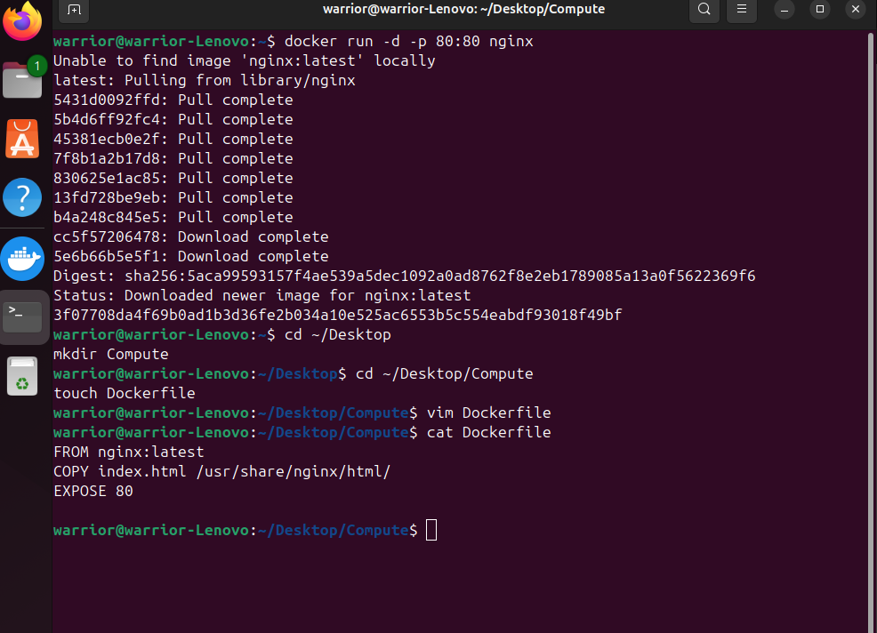
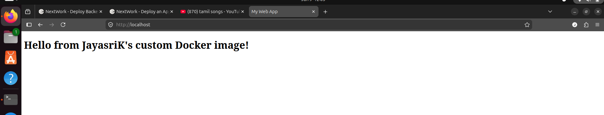

# 🚀 Deploy a Dockerized Web Application on AWS Elastic Beanstalk

## 📖 Project Overview

This project demonstrates how to containerize a web application using Docker and deploy it to AWS Elastic Beanstalk.

The application consists of a simple HTML webpage served through an Nginx web server running inside a Docker container. After testing locally, the application is deployed to AWS Elastic Beanstalk, which automatically provisions the required infrastructure and hosts the application on the internet.

This project provides hands-on experience with:

- Docker
- Container Images
- Containers
- Nginx
- AWS Elastic Beanstalk
- IAM Roles
- EC2
- Application Deployment
- Cloud Infrastructure Management

---

# 🏗️ Architecture


---

# 🎯 Project Objectives

The goals of this project were:

- Install and configure Docker
- Understand containerization
- Build a custom Docker image
- Run containers locally
- Deploy a Dockerized application
- Learn Elastic Beanstalk deployment workflow
- Understand IAM roles and instance profiles
- Manage application updates
- Clean up AWS resources

---

# 🐳 Understanding Docker

## What is Docker?

Docker is a platform that allows developers to package applications and their dependencies into lightweight units called containers.

Benefits:

- Consistent environments
- Faster deployments
- Portability
- Simplified development workflow

---

## What is a Container?

A container is a running instance of an application.

It contains:

- Application code
- Runtime
- Libraries
- Dependencies
- Configuration files

Containers solve the classic:

> "It works on my machine" problem.

---

## What is a Container Image?

A container image acts as a blueprint for creating containers.

The image contains:

- Operating system layer
- Application code
- Dependencies
- Configuration

A single image can create multiple containers.

---

# 🛠️ Project Implementation

## Step 1: Install Docker

Docker Desktop was installed on the local machine.

Verification:

```bash
docker --version
```

Expected Output:

```bash
Docker version xx.xx.xx
```

---

## Step 2: Run a Pre-built Container

Pulled and ran the official Nginx image.

```bash
docker run -d -p 80:80 nginx
```

Explanation:

| Option | Purpose |
|----------|----------|
| -d | Run container in background |
| -p 80:80 | Map host port to container port |
| nginx | Image name |

Access:

```text
http://localhost
```


Result:

Nginx Welcome Page displayed successfully.

---

## Step 3: Build a Custom Docker Image

Created project directory:

```bash
mkdir Compute
cd Compute
```

Created Dockerfile:

```dockerfile
FROM nginx:latest

COPY index.html /usr/share/nginx/html/

EXPOSE 80
```



Created index.html:

```html
<!doctype html>
<html>
<head>
<title>My Web App</title>
</head>
<body>

<h1>Hello from Jayasri's custom Docker image!</h1>

</body>
</html>
```

---

## Step 4: Build the Image

```bash
docker build -t my-web-app .
```

Explanation:

| Command | Purpose |
|----------|----------|
| docker build | Build image |
| -t | Assign image name |
| my-web-app | Image name |
| . | Current directory |

Verify image:

```bash
docker images
```

---

## Step 5: Run Custom Container

```bash
docker run -d -p 80:80 my-web-app
```

Open:

```text
http://localhost
```


Result:

Custom webpage displayed successfully.


---

# ☁️ AWS Elastic Beanstalk Deployment

## What is Elastic Beanstalk?

AWS Elastic Beanstalk is a Platform as a Service (PaaS) that simplifies application deployment.

It automatically manages:

- EC2 Instances
- Security Groups
- Load Balancing
- Monitoring
- Scaling
- Health Checks

---

## Deployment Package

Created ZIP containing:

```text
Compute/
│
├── Dockerfile
└── index.html
```

Important:

Only the files were zipped.

❌ Wrong

```text
Compute.zip
 └── Compute/
```

✅ Correct

```text
deployment.zip
 ├── Dockerfile
 └── index.html
```

---

## Elastic Beanstalk Configuration

### Application

```text
Application Name:
NextWork App
```

### Platform

```text
Docker
```

### Environment Type

```text
Single Instance
```

### Version Label

```text
Version One
```

---

# 🔐 IAM Configuration

## Service Role

Created:

```text
aws-elasticbeanstalk-service-role
```

Policies:

- AWSElasticBeanstalkEnhancedHealth
- AWSElasticBeanstalkManagedUpdatesCustomerRolePolicy


---

## EC2 Instance Profile

Created:

```text
ecsInstanceRole
```

Policies:

- AWSElasticBeanstalkMulticontainerDocker
- AWSElasticBeanstalkWebTier
- AWSElasticBeanstalkWorkerTier

---

# 🌐 Networking Configuration

### Public IP

Enabled

```text
Public IP = True
```

Purpose:

Allows public internet access to the application.

---

# 💾 Storage Configuration

### Root Volume

```text
Type: gp3
Size: 10 GB
```

Reason:

- Free Tier eligible
- Good performance
- Cost efficient

---

# 📊 Monitoring Configuration

```text
System = Basic
```

Managed Updates:

```text
Disabled
```

Deployment Policy:

```text
All At Once
```

---

# 🚀 Deployment Result

Elastic Beanstalk automatically:

- Created EC2 instance
- Configured networking
- Installed Docker
- Built container
- Started application


Result:

Application accessible through Elastic Beanstalk Domain URL.

---

# 💎 Secret Mission: Application Update

Updated:

```html
<h2>And here's a special image chosen by me:</h2>


```

Created a new ZIP package.

Uploaded through:

```text
Elastic Beanstalk
→ Upload and Deploy
```

Version Label:

```text
Version Two
```


Result:

Updated application deployed successfully without recreating the environment.

---

# ⚠️ Troubleshooting

## Error: Docker Command Not Found

Error:

```bash
docker: command not found
```

Solution:

- Restart Docker Desktop
- Restart terminal
- Verify Docker installation

Check:

```bash
docker --version
```

---

## Error: Port 80 Already In Use

Error:

```bash
Bind for 0.0.0.0:80 failed
```

Cause:

Nginx container already running.

Find container:

```bash
docker ps
```

Stop container:

```bash
docker stop CONTAINER_ID
```

Run application again.

---

## Error: Elastic Beanstalk Deployment Failed

Possible causes:

### Incorrect ZIP Structure

Elastic Beanstalk expects:

```text
Dockerfile
index.html
```

inside ZIP root.

---

### Wrong Volume Type

Use:

```text
gp3
```

NOT:

```text
gp2
```

---

### Missing IAM Roles

Verify:

```text
aws-elasticbeanstalk-service-role
```

and

```text
ecsInstanceRole
```

exist.

---

## Error: Cannot Delete S3 Bucket

Cause:

Bucket Policy still exists.

Solution:

```text
S3
→ Bucket
→ Permissions
→ Delete Bucket Policy
```

Then delete bucket.

---

# 🧹 Resource Cleanup

## Terminate Environment

Elastic Beanstalk

```text
Actions
→ Terminate Environment
```

---

## Delete Application

```text
Applications
→ Delete Application
```

---

## Delete S3 Bucket

Delete:

```text
elasticbeanstalk-*
```

bucket created automatically by AWS.

---

## Remove Docker Containers

List:

```bash
docker ps -a
```

Stop:

```bash
docker stop CONTAINER_ID
```

Delete:

```bash
docker rm CONTAINER_ID
```

---

## Remove Images

List:

```bash
docker images
```

Delete:

```bash
docker rmi IMAGE_ID
```

---

# 📚 Key Learnings

Throughout this project I learned:

- Docker fundamentals
- Container lifecycle
- Dockerfile creation
- Building custom images
- Running containers
- Port mapping
- Nginx web hosting
- Elastic Beanstalk deployment
- IAM Roles and Instance Profiles
- Infrastructure automation
- Cloud application deployment
- Application version updates
- Resource cleanup best practices

---

# 🛠️ AWS Services Used

- AWS Elastic Beanstalk
- Amazon EC2
- AWS IAM
- Amazon S3
- Security Groups

---

# 🎓 Skills Gained

- Docker
- Containerization
- AWS Cloud
- Elastic Beanstalk
- EC2
- IAM
- Linux Commands
- Application Deployment
- DevOps Fundamentals
- Troubleshooting

---

# 📸 Screenshots

Add screenshots here:

1. Docker Desktop Dashboard
2. Nginx Welcome Page
3. Dockerfile
4. Custom Webpage
5. Elastic Beanstalk Environment
6. Successful Deployment
7. Updated Application (Version Two)

---

# 👩‍💻 Author

**Jayasri K**

Aspiring Cloud & DevOps Engineer

- AWS Cloud Projects
- Java Full Stack Development
- Docker & Kubernetes Enthusiast
- FinTech & Cloud Computing Learner
